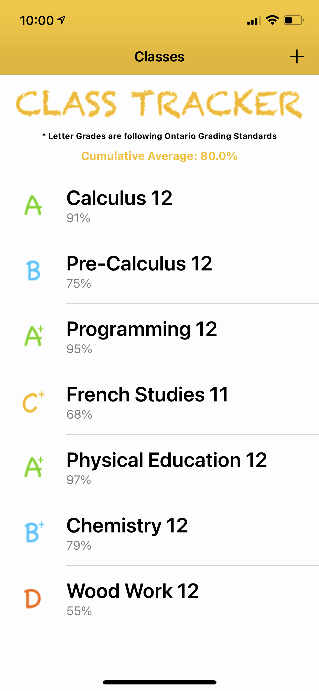
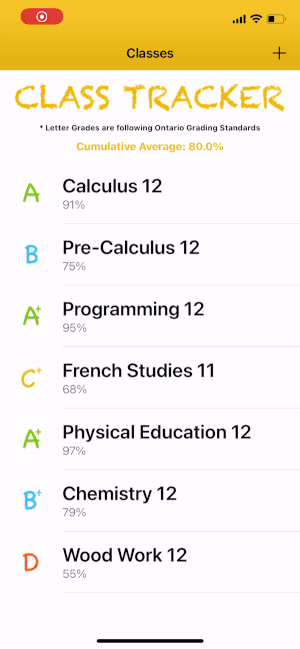
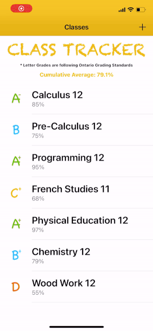
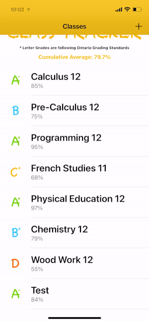
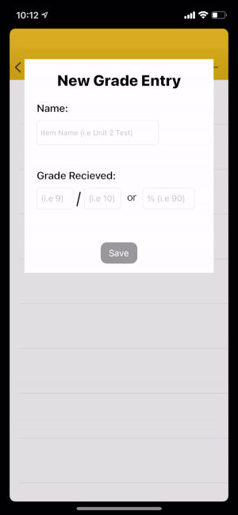

# Class-Tracker

Class Tracker allows students of all levels to easily track and compute their current grade for every class. Simply enter your class name, syllabus items + their respecitve weights and indivisual grades to get a clear view of your current grade. No more long complex computations to figure out your current grade or future grade depending on if you `x %` on the final. You can also say goodbye to waiting days or even weeks for teachers to email out updated marks. Class Tracker also intelligently adjusts marks for classes where the weight of all syllabus items do not add to 100. 

## Demo

*All videos have been changed to 10fps or less and sped up for space considerations

- Example Home Screen (Cumulative Average calculated on top)

- Adding a new test score to a class

- Adding a new class and syllabus items

- Deleting grades, syllabus items and classes

- Text field validation (weights are required to be numbers & grades must have valid parameters before saving)

 | 

## To Do List

- Implement Graph allowing users to view the history of their grades
- Create a "Term" heirarchy where classes are placed in Terms
- Add a To Do list section for each class. Here a user can store a list of tasks that must be completed for each class (i.e "Complete Assignment #2 by Thursday")
